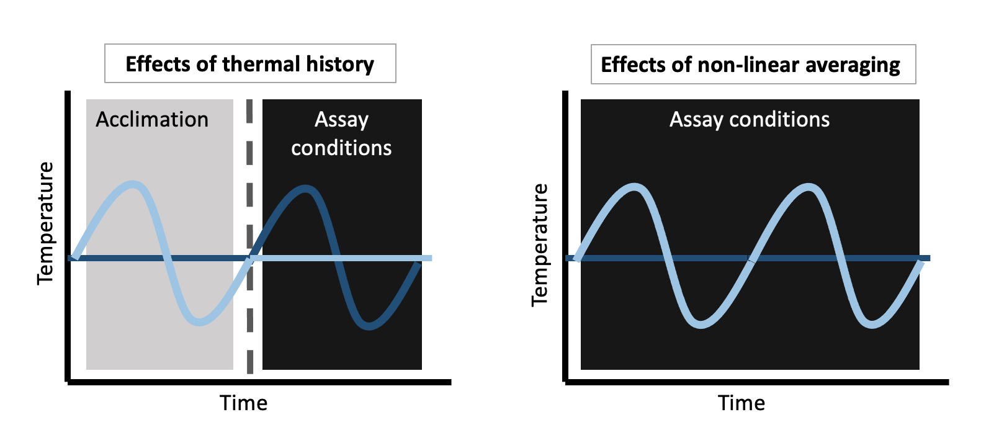

```{r setup, include=FALSE}
knitr::opts_chunk$set(echo = TRUE)
```

```{r, echo=FALSE, results = 'hide', message=FALSE}
## loading libraries 
pacman::p_load(metafor, tidyverse, viridis, visreg, forcats, devtools, patchwork, R.rsp)
#devtools::install_github("itchyshin/orchard_plot", subdir = "orchaRd", method= 'libcurl', force = TRUE, build_vignettes = TRUE)
library(orchaRd)
#load data
dat_acclim_0<- read_csv("acclimation_dummytherm_30jun.csv")
dat_full_var_0 <- read_csv("metafor.csv")
```

```{r, echo= FALSE, results = 'hide', message=FALSE}
##wrangling calculations for acclimation data
#make standardized SD columns based on N and SE vs SD
dat_acclim <-dat_acclim_0 %>% 
  mutate ( SD_constant= if_else ( variance_type== 0, constant_variance * sqrt(constant_samp), constant_variance))  %>%
  mutate ( SD_variable= if_else ( variance_type== 0, flux_variance * sqrt(flux_variance) , flux_variance)) 
         
#calculate ES for data
dat_acclim_ES <-escalc(measure="SMD", m1i=constant_resp, m2i=flux_resp, 
            sd1i=`SD_constant`, sd2i= `SD_variable`, n1i=constant_samp, n2i=flux_samp, 
            data=dat_acclim, slab=paste(study_id, experiment_id, response_id, sep=", ")) 

# Note in the above, you loose ~15% of data because of missing sample sizes and SEs reported, below these are removed for now
dat_acclim_ES<-dat_acclim_ES %>% 
  filter (!is.na(yi)) %>%
  mutate(metric = case_when(resp_def %in% c("log CO2 production", 
                                            "maximal swimming speed", 
                                            "Maximum burst swim speed", 
                                            "Oxygen consumption", 
                                            "Performance breadth (Tbr)",
                                            "Time to heat knockdown",
                                            "Scope of thermal tolerance (CTmax - CTmin)",
                                            "RMR", 
                                            "Speed", "Thermal preference", 
                                            "Topt", "Tpref", 
                                            "Ucrit", "Umax") ~ "Pmax",
                            resp_def %in% c("CTmin", "LTmin") ~ "CTmin",
                            resp_def %in% c("CT max", "CTmax", "LTmax", "ULT50") ~ "CTmax",
                            resp_def %in% c("LDH activity", "CCO activity", 
                                            "CS activity") ~ "Biochemical"
                            ))
```


```{r, echo= FALSE, results = 'hide', message=FALSE}
##wrangling calculations for full variability data
#make standardized SD columns based on N and SE vs SD
dat_full_var <-dat_full_var_0 %>% 
  mutate ( SD_constant= if_else ( variance_type== 0, constant_variance * sqrt(constant_samp), constant_variance))  %>%
  mutate ( SD_variable= if_else ( variance_type== 0, flux_variance * sqrt(flux_variance) , flux_variance)) 
         
#calculate ES for data
dat_full_var_ES <-escalc(measure="SMD", m1i=constant_resp, m2i=flux_resp, 
            sd1i=`SD_constant`, sd2i= `SD_variable`, n1i=constant_samp, n2i=flux_samp, 
            data=dat_full_var, slab=paste(study_id, experiment_id, response_id, sep=", ")) 

# Note in the above, you loose ~15% of data because of missing sample sizes and SEs reported, below these are removed for now
dat_full_var_ES<-dat_full_var_ES %>% 
  filter (!is.na(yi)) %>%
  mutate(metric = case_when(resp_def %in% c("abdomen length", "adult weight", 
                                            "blade length/total leaf length", 
                                            "body length", "body mass", "body size", 
                                            "body weight", "carapace height", 
                                            "carapace width", 
                                            "final length", "final mass",
                                            "fore-limb length", 
                                            "group mean body weight", 
                                            "head length", "head width", 
                                            "hind-limb length", 
                                            "hypocotyl length", "mass", 
                                            "maximal length", 
                                            "snout-vent length", "tail length",
                                            "total length", 
                                            "wing centroid", "body (centroid) size", 
                                            "egg mass", "ovary mass, dry", 
                                             "testes mass, dry", 
                                             "pupal shell weight", "pupal weight") ~ "size", 
                            resp_def %in%  c("average cumulative number of eggs laid per female",
                                             "hatching success", 
                                             "offspring per mating",
                                             "total offspring", 
                                             "percent females") ~ "fecundity",
                            resp_def %in% c("Adult eclosion to death", 
                                            "dessication tolerance", 
                                            "egg to adult viability",
                                            "infestation rate", 
                                            "Mortaility", 
                                            "Parasitism success", 
                                            "startvation tolerance", 
                                            "success of parasitism", 
                                            "survival", "Survival", 
                                            "Larval mortaility", "longevity") ~ "survivorship", 
                            resp_def %in% c("aquatic speed", 
                                            "daily energy expenditure", 
                                            "distance covered", 
                                            "Energy consumption", 
                                            "feeding efficiency", 
                                            "feeding rate", ,
                                            "RMR", "sprint speed",
                                          "Sqrt Cellular energy allocation (CEA)", 
                                            "Sqrt of available energy", 
                                          "population growth rate","productivity", 
                                             "rate of change", 
                                             "specific growth rate") ~ "energetics", 
                            resp_def %in% c("development time", 
                                            "development to stages 35-37", 
                                            "days to first slough", 
                                            "developmental time", 
                                            "egg to adult", 
                                            "egg to pupa", "incubation period", 
                                            "median days to bolt", 
                                            "Third instar to adult", 
                                            "Third instar to pupa") ~ "development", 
                            resp_def %in% c("Catalase", "cortisol",
                                             "Hexokinase", "Hsp70", 
                                            "oxidative damage", 
                                            "Pyruvate kinase", "TAC", 
                                            "SOD", "glucose") ~ "biochemistry"))

count(dat_full_var_ES, metric)
```
# Motivation and Hypotheses

Variability has been identified as important to organismal success and ecosystem dynamics (Vasseur et al 2014). To further understand the impacts of variability of performance, we conducted to analyses on data that explicitly accounted for acclimation (Acclimation model) and studies focuses solely on non-linear averaging (Non-linear averaging model). 

H-Acclimation: If reared in fluctuating environments, when exposed to different thermal environments, organisms with larger fluctuation ranges will perform worse than those reared in constant environments. Additional covariates, such as age, size, and expsoure temperature will be correlated negative responses.

H-Non-linear averaging: Organisms will perform better in constant environments than fluctuating environments. Additional covariates, such as age, size, and large fluctuation range will be correlated negative responses.

```{r pressure, echo=FALSE, fig.cap="Conceptual figure demonstrating how acclimation and non-linear averaging account for different aspects of performance.", out.width = '100%'}

```

\clearpage


# Acclimation Model 

This data and analysis accounts for the temperatures at which organisms are reared and how their performance compares when exposed to different temperature. The results from this model has very similar results from the model I originally ran for my thesis...

## Acclimation with temperature modifiers
```{r, echo=FALSE}
temp_acclimation_model <- rma.mv(yi, vi, data=dat_acclim_ES, mods=~flux_range * mean_temp_reared,
               random = ~1 | study_id / experiment_id/ response_id,
                 method="REML") 
summary(temp_acclimation_model)
```

## Acclimation with trait modifiers
```{r, echo=FALSE}
trait_acclimation_model<-rma.mv(yi, vi, data=dat_acclim_ES, 
                                mods = ~exp_age + size + org_level + exposure_temp, 
               random = ~1 |  study_id/ experiment_id/ response_id,
                 method="REML") 
trait_acclimation_model
```

## Acclimation with all modifiers
```{r, echo=FALSE}
acclimation_model<-rma.mv(yi, vi, data=dat_acclim_ES, 
            mods = ~flux_range * mean_temp_reared + exp_age + size + org_level + exposure_temp +environment, 
               random = ~1 |  study_id/ response_id,
                 method="REML") 
acclimation_model
```


# Effects of non-linear averaging
This uses the full dataset from my thesis (with more data from the additional search). Interesting that this time, mean temp is the only significant predictor?

## Non-linear averaging model with temperature modifiers
```{r, echo= FALSE}
temp_full_var_model <- rma.mv(yi, vi, data=dat_full_var_ES, 
                                mods = ~flux_range * mean_temp_constant,
               random = ~1 | study_id / experiment_id/ response_id,
                 method="REML") 
temp_full_var_model
```

## Non-linear averaging model with trait modifiers
```{r, echo = FALSE}
trait_full_var_model <-rma.mv(yi, vi, data=dat_full_var_ES, mods = ~exp_age + size + org_level, 
               random = ~1 |  study_id/ experiment_id/ response_id,
                 method="REML") 
trait_full_var_model
```

## Non-linear averaging model with all modifiers
```{r, echo = FALSE}

full_var_model <-rma.mv(yi, vi, data=dat_full_var_ES, 
                        mods = ~flux_range * mean_temp_constant + exp_age + size + org_level +environment, 
               random = list(~1 | study_id/ response_id),
                 method="REML") 
full_var_model

pacman::p_load(esc, dmetar)
summary(full_var_model)
convert_z2r(1.3702) #r=0.8787378

summary(acclimation_model)
convert_z2r(6.0093) #r=0.9999879

acclimation_model

##I-SQUARED CALCS FROM ASSINK + WIBBELINK 2016 (doi:10.20982/tqmp.12.3.p154)
n <- length(dat_acclim_ES$vi)
list.inverse.variances <- 1 / (dat_acclim_ES$vi)
sum.inverse.variances <- sum(list.inverse.variances)
squared.sum.inverse.variances <- (sum.inverse.variances) ^ 2
list.inverse.variances.square <- 1 / (dat_acclim_ES$vi^2)
sum.inverse.variances.square <-
sum(list.inverse.variances.square)
numerator <- (n - 1) * sum.inverse.variances
denominator <- squared.sum.inverse.variances -
sum.inverse.variances.square
estimated.sampling.variance <- numerator / denominator
I2_1 <- (estimated.sampling.variance) / (acclimation_model$sigma2[1]
+ acclimation_model$sigma2[2] + estimated.sampling.variance)
I2_2 <- (acclimation_model$sigma2[1]) / (acclimation_model$sigma2[1]
+ acclimation_model$sigma2[2] + estimated.sampling.variance)
I2_3 <- (acclimation_model$sigma2[2]) / (acclimation_model$sigma2[1]
+ acclimation_model$sigma2[2] + estimated.sampling.variance)


amountvariancelevel1 <- I2_1 * 100
amountvariancelevel2 <- I2_2 * 100
amountvariancelevel3 <- I2_3 * 100
amountvariancelevel1 ##16.20628
amountvariancelevel2 ##1.966446e-06
amountvariancelevel3 ##83.79732

n_f <- length(dat_full_var_ES$vi)
list.inverse.variances_f <- 1 / (dat_full_var_ES$vi)
sum.inverse.variances_f <- sum(list.inverse.variances_f)
squared.sum.inverse.variances_f <- (sum.inverse.variances_f) ^ 2
list.inverse.variances.square_f <- 1 / (dat_full_var_ES$vi^2)
sum.inverse.variances.square_f <-
sum(list.inverse.variances.square_f)
numerator_f <- (n_f - 1) * sum.inverse.variances_f
denominator_f <- squared.sum.inverse.variances_f -
sum.inverse.variances.square_f
estimated.sampling.variance_f <- numerator_f / denominator_f
I2_1f <- (estimated.sampling.variance_f) / (full_var_model$sigma2[1]
+ full_var_model$sigma2[2] + estimated.sampling.variance_f)
I2_2f <- (full_var_model$sigma2[1]) / (full_var_model$sigma2[1]
+ full_var_model$sigma2[2] + estimated.sampling.variance_f)
I2_3f <- (full_var_model$sigma2[2]) / (full_var_model$sigma2[1]
+ full_var_model$sigma2[2] + estimated.sampling.variance_f)


amountvariancelevel1f <- I2_1f * 100
amountvariancelevel2f <- I2_2f * 100
amountvariancelevel3f <- I2_3f * 100
amountvariancelevel1f #7.629274
amountvariancelevel2f #15.61584
amountvariancelevel3f #76.75488

```


```{r}
#looking at the effects sizes for each categorical moderator not related to temperature...
# acclimation analysis 

a <- dat_acclim_ES %>%
  group_by(size) %>%
  summarise(mean_yi = mean(yi),
            mean_vi = mean(vi)) %>%
  ggplot(aes(x=as.factor(size), y=mean_yi, fill = mean_yi > 0))+
  geom_errorbar(aes(ymin=mean_yi-mean_vi, ymax=mean_yi+mean_vi), width=.2)+
  geom_point(size = 4, show.legend = FALSE, pch=21,colour="black")+
  scale_fill_viridis(discrete = TRUE)+
  xlab("Body Size")+
  ylim(-1,3.5)+
  ggtitle("ACCLIMATION")+
  coord_flip()
  

b <- dat_acclim_ES %>%
  group_by(exp_age) %>%
  summarise(mean_yi = mean(yi),
            mean_vi = mean(vi)) %>%
  ggplot(aes(x=as.factor(exp_age), y=mean_yi, fill = mean_yi > 0))+
  geom_errorbar(aes(ymin=mean_yi-mean_vi, ymax=mean_yi+mean_vi), width=.2)+
  geom_point(size = 4, show.legend = FALSE, pch=21,colour="black")+
  scale_fill_viridis(discrete = TRUE)+
  xlab("Age")+
  ylim(-1,0.75)+
  coord_flip()

c <- dat_acclim_ES %>%
  group_by(environment) %>%
  summarise(mean_yi = mean(yi),
            mean_vi = mean(vi)) %>%
  ggplot(aes(x=as.factor(environment), y=mean_yi, fill = mean_yi > 0))+
  geom_errorbar(aes(ymin=mean_yi-mean_vi, ymax=mean_yi+mean_vi), width=.2)+
  geom_point(size = 4, show.legend = FALSE, pch=21,colour="black")+
  scale_fill_viridis(discrete = TRUE)+
  xlab("Environment")+
  ylim(-1,0.5)+
  coord_flip()


# assay analysis
d <- dat_full_var_ES %>%
  group_by(size) %>%
  summarise(mean_yi = mean(yi),
            mean_vi = mean(vi)) %>%
  ggplot(aes(x=as.factor(size), y=mean_yi, fill = mean_yi > 0))+
  geom_errorbar(aes(ymin=mean_yi-mean_vi, ymax=mean_yi+mean_vi), width=.2)+
  geom_point(size = 4, show.legend = FALSE, pch=21,colour="black")+
  scale_fill_viridis(discrete = TRUE)+
  xlab("Body Size")+
  ylim(-1,3.5)+
  ggtitle("ASSAY")+
  coord_flip()

e <- dat_full_var_ES %>%
  group_by(exp_age) %>%
  summarise(mean_yi = mean(yi),
            mean_vi = mean(vi)) %>%
  ggplot(aes(x=as.factor(exp_age), y=mean_yi, fill = mean_yi > 0))+
  geom_errorbar(aes(ymin=mean_yi-mean_vi, ymax=mean_yi+mean_vi), width=.2)+
  geom_point(size = 4, show.legend = FALSE, pch=21,colour="black")+
  scale_fill_viridis(discrete = TRUE)+
  xlab("Age")+
  ylim(-1,0.75)+
  coord_flip()

f <- dat_full_var_ES %>%
  group_by(org_level) %>%
  summarise(mean_yi = mean(yi),
            mean_vi = mean(vi)) %>%
  ggplot(aes(x=as.factor(org_level), y=mean_yi, fill = mean_yi > 0))+
  geom_errorbar(aes(ymin=mean_yi-mean_vi, ymax=mean_yi+mean_vi), width=.2)+
  geom_point(size = 4, show.legend = FALSE, pch=21,colour="black")+
  scale_fill_viridis(discrete = TRUE)+
  xlab("Organization Level")+
  ggtitle("ASSAY")+
  coord_flip()

g <- dat_full_var_ES %>%
  group_by(environment) %>%
  summarise(mean_yi = mean(yi),
            mean_vi = mean(vi)) %>%
  ggplot(aes(x=as.factor(environment), y=mean_yi, fill = mean_yi > 0))+
  geom_errorbar(aes(ymin=mean_yi-mean_vi, ymax=mean_yi+mean_vi), width=.2)+
  geom_point(size = 4, show.legend = FALSE, pch=21,colour="black")+
  scale_fill_viridis(discrete = TRUE)+
  xlab("Environment")+
  ylim(-1,0.5)+
  coord_flip()

acclimation_mods<- a + b + c 
var_mods <- d + e + g

acclimation_mods / var_mods

f

```

```{r}
g <- dat_full_var_ES %>%
  group_by(metric)%>%
  summarise(mean_yi = mean(yi),
            mean_vi = mean(vi)) %>%
  ggplot(aes(x=metric, y=mean_yi, fill = mean_yi > 0))+
  geom_errorbar(aes(ymin=mean_yi-mean_vi, ymax=mean_yi+mean_vi), width=.2)+
  geom_point(size = 4, show.legend = FALSE, pch=21,colour="black")+
  scale_fill_viridis(discrete = TRUE)+
  xlab("Metric")+
  ylim(-2.6,1.7)+
  coord_flip()+
  ggtitle("ASSAY")


h <- dat_acclim_ES %>%
  group_by(metric)%>%
  summarise(mean_yi = mean(yi),
            mean_vi = mean(vi)) %>%
  ggplot(aes(x=metric, y=mean_yi, fill = mean_yi > 0))+
  geom_errorbar(aes(ymin=mean_yi-mean_vi, ymax=mean_yi+mean_vi), width=.2)+
  geom_point(size = 4, show.legend = FALSE, pch=21,colour="black")+
  scale_fill_viridis(discrete = TRUE)+
  xlab("Metric")+
  ylim(-2.6,1.7)+
  coord_flip()+
  ggtitle("ACCLIMATION")

h / g
```


```{r}
full_model_coefficients<- as.data.frame(coef(full_var_model)) %>%
  tibble::rownames_to_column("covariates") %>%
  rename(value = "coef(full_var_model)") %>%
  arrange(desc(value)) %>%
  mutate(coefficients = c("intercept", "experimental age", "fluctuation range:mean temperature",
                          "fluctuation range", "environmentterrestrial", "mean temperature",
                                       "size", "organization level" 
                                      ), 
         lb = c(0.4597, -0.0738, -0.0008, -0.0646, -0.7671, -0.0719, -0.5783, -0.8331), 
         ub= c(2.2806, 0.2150, 0.0031, 0.0227, 0.6876, -0.0214, 0.2861, 0.2738)) 


label.df_full <- data.frame(coefficients = c("intercept","mean temperature"),
                       value = c(0.35, -0.2))

ggplot(data=full_model_coefficients, aes(x = reorder(coefficients, value),
             y = value,
             fill = value > 0)) +
  geom_errorbar(aes(ymin=lb, ymax=ub), width=.2, size =0.6,
                 position=position_dodge(.95), color = "black")+ 
  geom_point(size = 3, show.legend = FALSE, pch=21,colour="black") +
  labs(x = NULL, y = "Coefficient estimate") +
  scale_fill_viridis(discrete = TRUE)+
  theme_bw()+
  coord_flip()+
  geom_text(data=label.df_full, label = "*", color = "black", size = 6)


acclim_model_coefficients<- as.data.frame(coef(acclimation_model)) %>%
  tibble::rownames_to_column("covariates") %>%
  rename(value = "coef(acclimation_model)") %>%
  arrange(desc(value)) %>%
  mutate(coefficients = c("intercept", "fluctuation range:mean temperature",  "exposure_temp",
                          "experimental age", "mean temperature", 
                          "fluctuation range", "environmentterrestrial","size"), 
         lb = c(3.2855, 0.0140, -0.0030, -0.7078, -0.3457, -0.6700, -2.5526, -1.4671), 
         ub= c(8.6331, 0.0312, 0.0093, 0.5405, -0.1733, -0.2814, 1.0587, 0.1290)) 

label.df_acclim <- data.frame(coefficients = c("intercept", "fluctuation range:mean temperature", "mean temperature", "fluctuation range"),
                       value = c(3, -0.5, -0.7, -1))

ggplot(data=acclim_model_coefficients, aes(x = reorder(coefficients, value),
             y = value,
             fill = value > 0)) +
  geom_errorbar(aes(ymin=lb, ymax=ub), width=.2, size =0.6,
                 position=position_dodge(.95), color = "black")+ 
  geom_point(size = 3, show.legend = FALSE, pch=21,colour="black") +
  labs(x = NULL, y = "Coefficient estimate") +
  scale_fill_viridis(discrete = TRUE)+
  theme_bw()+
  coord_flip()+
  geom_text(data=label.df_acclim, label = "*", color = "black", size = 6)
```


```{r}
#Model selection 
AIC(temp_acclimation_model, trait_acclimation_model, acclimation_model, temp_full_var_model, trait_full_var_model, full_var_model)
```

# Figures

```{r, echo=FALSE}
#creating orchard plot with trimmed/normalized effect sizes from both datasets
normalized_acclim <- dat_acclim_ES %>% filter(between(yi, -5, 5))
normalized_var <- dat_full_var_ES  %>% filter(between(yi, -5, 5))
#corresponding models
dummy_acclim <- rma.mv(yi, vi, data=normalized_acclim, 
               random = ~1 |  study_id/ response_id,
                 method="REML")
dummy_var <- rma.mv(yi, vi, data=normalized_var, 
               random = ~1 |  study_id/ response_id,
                 method="REML")
#calculating I2 for each of the analyses
I2_acclim <- i2_ml(dummy_var)
I2_var <-i2_ml(dummy_acclim)
#orchard plots 
p1 <- orchard_plot(dummy_acclim, mod = "Int", xlab = "Standardised mean difference", transfm = "none", )+
  annotate(geom = "text", x = 0, y = 1.5, label = "Acclimation")+
  annotate(geom = "text", x = -4.7, y = 1.5, label = paste0("italic(I)^{2} == ",
round(I2_acclim[1] * 100, 2)), color = "black", parse = TRUE, size = 5) + annotate(geom = "text",
x = -3.7, y = 1.49, label = "%", color = "black", parse = FALSE, size = 5)

p2 <- orchard_plot(dummy_var, mod = "Int", xlab = "Standardised mean difference", transfm = "none")+
  annotate(geom = "text", x = 0, y = 1.5, label = "Non-linear averaging and acclimation")+
  annotate(geom = "text", x = -4.1, y = 1.5, label = paste0("italic(I)^{2} == ",
round(I2_var[1] * 100, 2)), color = "black", parse = TRUE, size = 5) + annotate(geom = "text",
x = -3.1, y = 1.49, label = "%", color = "black", parse = FALSE, size = 5)
p1 / p2
```


```{r, echo=FALSE}
#calculating mean effect sizes by mean temperature and flux range for ggplots
mean_temp_acclim <- normalized_acclim %>%
  group_by(mean_temp_reared, flux_range) %>%
  summarise(yi=mean(yi), 
            vi=mean(vi))

mean_var<-normalized_var %>%
  group_by(mean_temp_constant, flux_range) %>%
  summarise(yi=mean(yi), 
            vi=mean(vi))
```

```{r, echo=FALSE}
ggplot(normalized_acclim, aes(y=yi, x=mean_temp_reared, fill=flux_range))+
  geom_line(y=0, linetype = "dashed")+
  geom_jitter(alpha = 0.5, pch=21,size=1, width = 0.7, height = 0.7)+
  geom_errorbar(data=mean_temp_acclim, aes(ymin=yi-vi, ymax=yi+vi), size=.7, width=.4, color = "black")+
  geom_point(data = mean_temp_acclim, size=4, pch=21, colour="black")+
  theme_bw()+
  scale_fill_viridis()+
  ggtitle("Acclimation and fluctuation range")+
  labs(x = "Mean temperature (°C)",
       y ="SMD",
       fill = "Temperature fluctuation range (°C)")+
  theme(legend.position="bottom")
 
ggplot(normalized_var, aes(y=yi, x=mean_temp_constant, fill=flux_range))+
  geom_jitter(alpha = 0.5, pch=21,size=1, width = 0.3, height = 0.7)+
  geom_line(y=0, linetype = "dashed")+
  geom_errorbar(data=mean_var, aes(ymin=yi-vi, ymax=yi+vi), size=.7, width=.4, color = "black")+
  geom_jitter(data = mean_var, size=4, pch=21, colour="black")+
  theme_bw()+
  scale_fill_viridis()+
  ggtitle("Non-linear averaging + acclimation and fluctuation range")+
  labs(x = "Mean temperature (°C)",
       y ="SMD",
       fill = "Temperature fluctuation range (°C)")+
  theme(legend.position="bottom")
  

ggplot(normalized_var, aes(y=yi, x=mean_temp_constant, fill=mean_temp_constant))+
  geom_jitter(alpha = 0.5, pch=21,size=1, width = 0.3, height = 0.7)+
  geom_line(y=0, linetype = "dashed")+
  geom_errorbar(data=mean_var, aes(ymin=yi-vi, ymax=yi+vi), size=.7, width=.4, color = "black")+
  geom_jitter(data = mean_var, size=4, pch=21, colour="black")+
  theme_bw()+
  scale_fill_viridis()+
  ggtitle("Non-linear averaging + acclimation and mean temperature")+
  labs(x = "Mean temperature (°C)",
       y ="SMD",
       fill = "Mean temperature (°C)")+
  theme(legend.position="bottom")
```


## Funnel plot of acclimation data 
````{r, echo=FALSE}
funnel(dummy_acclim, level=c(90, 95, 99), shade=c("white", "gray55", "gray75"), refline=0, legend=TRUE)
```
## Funnel plot of non-linear averaging + acclimation data 
````{r, echo=FALSE}
funnel(dummy_var, level=c(90, 95, 99), shade=c("white", "gray55", "gray75"), refline=0, legend=TRUE)
```


# Supplementary code and models 

```{r, echo=FALSE}
p3<-normalized_acclim %>%
  ggplot(aes(x=flux_range, y=yi, color=as.factor(mean_temp_reared)))+
  scale_color_viridis(discrete=TRUE)+
  geom_point(size=3, alpha =0.5)+
  geom_smooth(method="lm")+
  theme_bw()

p4<-normalized_var %>%
  ggplot(aes(x=flux_range, y=yi, color=as.factor(mean_temp_constant)))+
  scale_color_viridis(discrete=TRUE)+
  geom_point(size= 3, alpha =0.5)+
  geom_smooth(method="lm")+
  theme_bw()
p3/p4

normalized_acclim %>%
  ggplot(aes(x=as.factor(flux_range), y=yi, color=as.factor(mean_temp_reared)))+
  scale_color_viridis(discrete = TRUE)+
  geom_boxplot()+
  geom_point(alpha=0.5)+
  theme_bw()

normalized_var %>%
  ggplot(aes(x=as.factor(flux_range), y=yi, color=as.factor(mean_temp_constant)))+
  scale_color_viridis(discrete = TRUE)+
  geom_boxplot()+
  geom_point(alpha=0.5)+
  theme_bw()

```


```{r, echo=FALSE}
forest_acclim<- dat_acclim_ES %>%
  group_by(mean_temp_reared, flux_range) %>%
  summarise(mean_yi = mean(yi),
            mean_vi = mean(vi)) %>%
  unite(group, c(mean_temp_reared, flux_range), sep = " range ", remove = FALSE)%>%
  arrange(desc(flux_range))

forest_var<- normalized_var %>%
  group_by(mean_temp_constant, flux_range) %>%
  summarise(mean_yi = mean(yi),
            mean_vi = mean(vi)) %>%
  unite(group, c(mean_temp_constant, flux_range), sep = "+/-", remove = FALSE) %>%
  arrange(desc(flux_range))

forest(forest_acclim$mean_yi, forest_acclim$mean_vi, slab=forest_acclim$group, pch =19, psize=1, col = "gray2", 
       header=TRUE, cex=0.77)

forest(forest_var$mean_yi, forest_var$mean_vi, slab=forest_var$group, pch =19, psize=1, col = "gray2", 
       header=TRUE, cex=0.77)

```


## Acclimation data split out by CT data and other thermal performance metrics 
```{r, echo=FALSE, message=FALSE, results='hide'}
CT_acclim_data <- dat_acclim_ES %>%
  filter(resp_def %in% c("CTmax", "CT max", "CTmin", "LTmax", "LTmin", "Topt", "Tpref", "Thermal preference", "ULT50", "Scope of thermal tolerance (CTmax - CTmin)"))

curve_acclim_data <- dat_acclim_ES %>%
  filter(resp_def %in% 
           c("CCO activity", "CS activity", "LDH activity", "log CO2 production", 
             "maximal swimming speed", "Maximum burst swim speed", 
             "Performance breadth (Tbr)", "RMR", "ULT50", "Speed", "Time to heat knockdown",
             "Ucrit", "Umax"))
```

## CT aggregated model 
```{r, echo=FALSE, message=FALSE, results='hide'}
CT_model <-rma.mv(yi, vi, data=CT_acclim_data, mods = ~flux_range * mean_temp_reared +
                        exp_age + size + org_level + exposure_temp, 
               random = ~1 |  study_id/ experiment_id/ response_id,
                 method="REML")
CT_model
```
## Remaining acclimation metrics model 
```{r, echo=FALSE, message=FALSE, results='hide'}
curve_model <- rma.mv(yi, vi, data=curve_acclim_data, mods = ~flux_range * mean_temp_reared +
                        exp_age + size + org_level + exposure_temp, 
               random = ~1 |  study_id/ experiment_id/ response_id,
                 method="REML")
curve_model
```