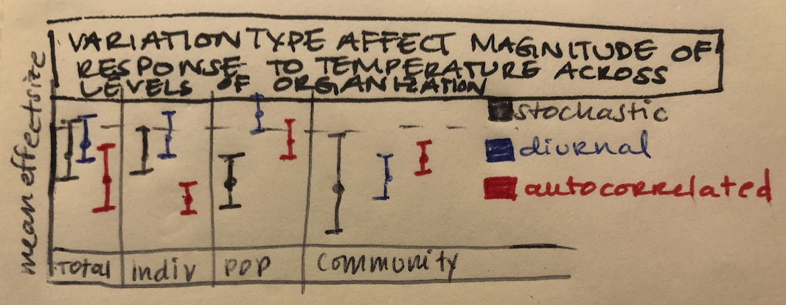
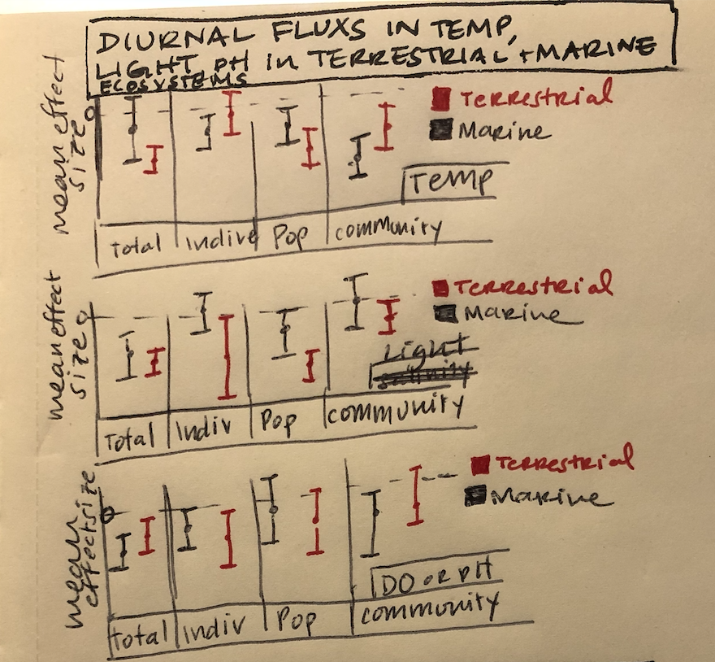

```{r setup, include=FALSE}
knitr::opts_chunk$set(echo = TRUE)
```

# Goals for today's meeting 
1. Updates to project questions and goals
2. Updates about ISI search results and terms 
3. Next steps for implementing methods

# Project updates

Last week we discussed how the second question listed below would be a better thematic guide to approaching this review but less able to address a quantitative question: 

*How is environmental variation (temperature, pH, nutrient composition) systematically studied and manipulated (duration and periodicity) across organismal, population, and community ecology and how does study design influence conclusions about environmental variation compare across these bodies of literature?*

I spent some time reading through the papers that Mary sent as well as looking through Web of Science for any inspiration. As a more detailed version of the question I posed last week: 

*Does environmental variation affect how rates scale across levels of biological organization?*

I have centered on the following potential directions for a quantitative project:

## Overarching goal:
Conduct a meta-analysis on some subsection of the ecological literature with respect to environmental variation across different levels of organizations

\newpage

**Option 1.**	Look exclusively at how temperature manipulations alter ecological rates across all levels of organization

* Driving question:
  + How does the magnitude of temperature response compare across different levels of organization when exposed to different types of temperature variation (diurnal, stochastic, autocorrelated etc.)

* Potential response variables: 
    + Individual: metabolic rate, TPC 
    +	Population: population growth rate, population density, carrying capacity
    + Community: biomass?, NPP? Other rate based metrics?
* Potential outcome: a more nuanced understanding of how the type of variation manipulation can drive differential responses across different levels of organization

```{r, echo=FALSE}

```

\newpage

**Option 2:** Look exclusively at diurnal fluctuations of 3 different environmental variables (temp, pH, salinity, DO, light, etc.) across all levels of organization 

* Driving question(s):
  + Is there a differential response at different levels of organization to variation in each of these variables 
  +	How do non-linear and linear response variables respond to stochastic vs. predictable variation?
      + look at a couple different environmental variables and how different manipulations of those variables coincides with either linear or non-linear response variables
* Potential response variables:
    + Individual: metabolic rate, growth rate, respiration rate (MMR)?
    + Population: population growth rate, population density, carrying capacity
    + Community: biomass?, NPP? Other rate based metrics?
* Potential outcome: a better understanding of these metrics that covary may not necessarily covary in their responses to variation across different levels of organization?


```{r, echo=FALSE}

```

# Methods

I spent some time reading the papers Mary sent as well as several other meta-analyses to draw ideas for how to conduct this meta-analysis. 

I really like the study design from Hackett et al 2013, specifically how they excluded factors that have been demonstrated as important (the effect of earthworms on soil biomass) to isolate the nuanced effects of micro and mega-fauna outside of those influential factors. This inspired attempts to devise a more detailed set of questions and outcomes from my original proposal. 

I was mainly inspired by a review by Kroeker et al 2020 that addressed themes in studying environmental variability from mainly an organismal perspective. This paper really referenced a lot of the thoughts Joey's Life paper addressed and I really liked the organization of this paper (really focusing on the importance and motivation behind drivers at different time scales). I would be really interested in asking similar questions with a quantitative lens. This paper focused mainly on predictable variation and I wonder how these conclusions might differ when compared with unpredictable variation. 

Figure 1 in Kroeker et al 2020 somewhat addresses what I wanted to accomplish with an NMDS plot, but I think it is a good jumping off place for thinking about how to design search terms and contextualize environmental variability bodies of literature

I conducted several advanced ISI searches to no avail, ending up with many more hits than my basic search, even when restricting by year and three specific journals:

1. TS=(“temporal variation” OR “spatial variation” AND temperature AND rates) OR SO=(JOURNAL OF ANIMAL ECOLOGY OR JOURNAL OF ANIMAL ECOLOGY OR THE JOURNAL OF ANIMAL ECOLOGY OR THE JOURNAL OF ANIMAL ECOLOGY) OR SO=(FRESHWATER ECOLOGY) OR SO=(ECOLOGY LETTERS OR ECOLOGY LETTERS) AND PY=(1970-2020) *(71,597)*

2. TS=( "environmental variation" AND temperature AND rates) OR SO=(JOURNAL OF ANIMAL ECOLOGY OR JOURNAL OF ANIMAL ECOLOGY OR THE JOURNAL OF ANIMAL ECOLOGY OR THE JOURNAL OF ANIMAL ECOLOGY) OR SO=(FRESHWATER ECOLOGY) OR SO=(ECOLOGY LETTERS OR ECOLOGY LETTERS) AND PY=(1970-2020) *(10,030)*

3. TS=( "environmental variation" AND temperature AND rates) OR SO=(JOURNAL OF ANIMAL ECOLOGY OR JOURNAL OF ANIMAL ECOLOGY OR THE JOURNAL OF ANIMAL ECOLOGY OR THE JOURNAL OF ANIMAL ECOLOGY) OR SO=(FRESHWATER ECOLOGY) OR SO=(ECOLOGY LETTERS OR ECOLOGY LETTERS) AND PY=(1970-2020) OR AK=("temporal variation" OR "spatial variation" OR "variable environments")  *(14,206)*

4. TS=( "environmental variation" AND temperature AND rates) OR SO=(JOURNAL OF ANIMAL ECOLOGY OR JOURNAL OF ANIMAL ECOLOGY OR THE JOURNAL OF ANIMAL ECOLOGY OR THE JOURNAL OF ANIMAL ECOLOGY) OR SO=(FRESHWATER ECOLOGY) OR SO=(ECOLOGY LETTERS OR ECOLOGY LETTERS) AND PY=(1970-2020) OR AK=("temporal variation" OR "spatial variation" OR "variable environments") 
Databases= WOS, BCI, KJD, RSCI, SCIELO, ZOOREC 
Timespan=1970-2018
Search language=Auto  *(11,242)*

5. TS=( "environmental variation" AND temperature AND rates AND diurnal OR circadian) OR SO=(JOURNAL OF ANIMAL ECOLOGY OR JOURNAL OF ANIMAL ECOLOGY OR THE JOURNAL OF ANIMAL ECOLOGY OR THE JOURNAL OF ANIMAL ECOLOGY) OR SO=(FRESHWATER ECOLOGY) OR SO=(ECOLOGY LETTERS OR ECOLOGY LETTERS) AND PY=(1970-2020) OR AK=("variable environments")
*(276,317)*


\newpage
# Next steps and questions 
* Is the world predicted to become more variable or more autocorrelated? 
    + And if the answer is both, how do they interact? 
    + Is it that while the world will become more like its surrounding conditions, those conditions will increase in amplitude or become more severe?
* How do I properly use ISI advanced searches to get narrower results?
* How do I accumulate the right amount of keywords to accomplish this?
* What is the right scope for the two proposed detailed questions for this thesis project?