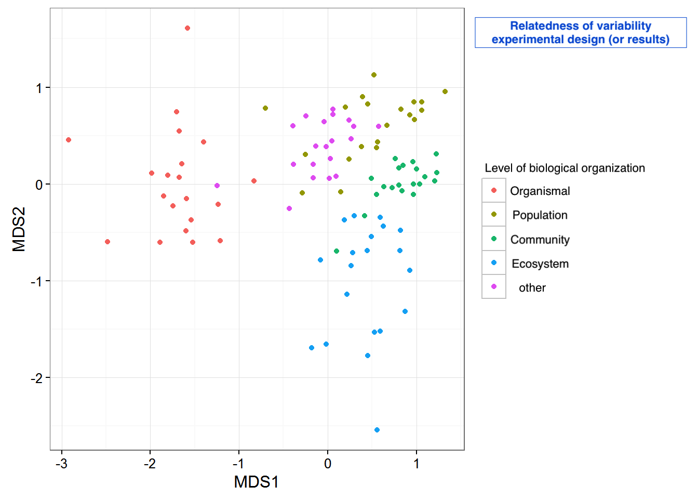
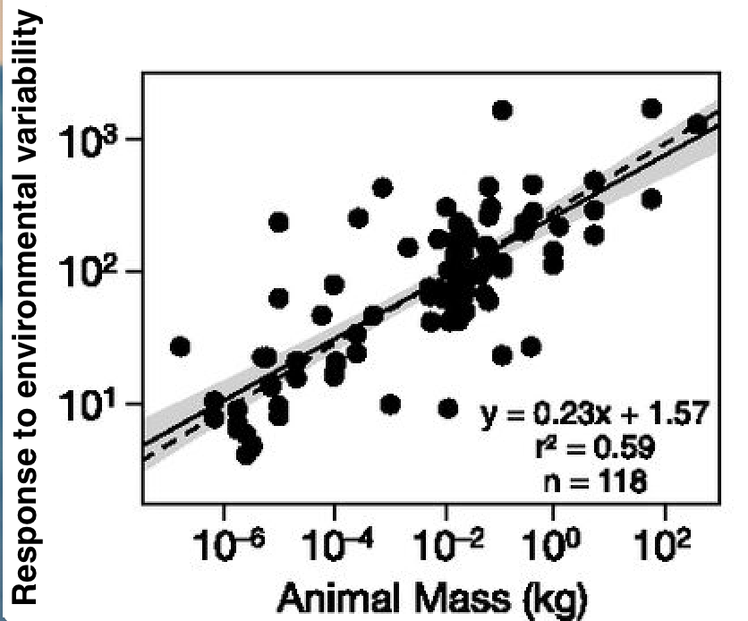

```{r setup, include=FALSE}
knitr::opts_chunk$set(echo = TRUE)
```

# Goals for today's meeting 
1. Discuss the project proposal below and the different ways to proceed
2. Discuss how to design proper search term parameters that provide a representative but managable study count
3. Outline timeline for regular meetings and when milestones for this project should accomplished
4. Discuss appropriate workflow for this project 

# Main Objectives 
1. How is environmental variation (temperature, pH, nutrient composition) systematically studied and manipulated across organismal, population, and community ecology and how does study design influence conclusions about environmental variation compare across these bodies of literature?

2. Does environmental variation affect how rates scale across levels of biological organization?

# Testable hypothesis
H0: There is no difference in how variation is studied at different levels of biological organization and thus the conclusions are the same across all levels.

Ha: Short term responses to simple environmental variation manipulation are prioritized at the organismal level, long term responses and more complex environmental variation manipulation is prioritized at the population and community level, owing to differential experimental design and conclusions about how variation type will interact in the ecosystem.

H02: Environmental variation does not affect how rate scale across levels of biological organization

Ha2: Environmental variation alters how rates scale across levels of biological organization by influencing metabolic rate.

# Methods
1. I will conduct a series of ISI literature searches to get a hollistic set of studies referencing environmental variation with selected keywords. I will then select studies based on a strict set of criteria and enter those studies into a spreadsheet, recording relevant information (study organism, biological organization level, variation type, response variable, etc.). 

Current search term ideas:
* "environmental variability" AND ecology AND temperature (1,281 results)
* "environmental variability" AND ecology (4049 results)
* "environmental variability" AND rate AND ecology (1,062 results)
* "environmental variability" AND ecology AND organism (802 results)
* "environmental variability" AND ecology AND population (2,458 results)
* "environmental variability" AND ecology AND community (1,275 results)
* "environmental variation" AND ecology (4,983 results)

2. I will then synthesize the patterns across studies to address my main objectives. This will culminate in a written document summarizing the language used in different sub-disciplines as well as the similarities and differences in conclusions about environmental variability. 

3. If there are studies that feature the same type of experimental design, I would like to conduct a meta-analaysis on that particular body of literature in R. 

4. If not, I would like to model environmental variability parameters from the different studies using R. (Less sure of how this could be achieved but I'd like to incorporate modelling components to this project)

# Potential Results
```{r, echo = FALSE}

```
Figure 1. Quantitative representation of the relatedness of environmental variability study work across different levels of biological organization (modified from http://environmentalcomputing.net/multidimensional-scaling/)


```{r, echo = FALSE}

```

Figure 2. Scaling of responses to environmental variability to animal body size (modified from Schramski et al 2015, PNAS)


# Timeline, Inference, and Next Steps
To accomplish this work I'd like to hit the following milestones:

* Narrow in on search terms (end of September)
* Decide on filter to select studies by (end of September)
* Filter through studies (end of fall semester)
* Theoretical foundation of modelling work in the spring (end of October)
* Premilinary literature review summary (end of fall semester)
* Data extraction complete (early March)
* Modelling work (end of March)


Figure 1 above will answer my questions about potential dissonance and gaps in environmental variability across different levels of organization and their respective field of study. An NMDS-like plot would be a quanitative way to display similarities and potential distinctions. 

Figure 2 is a simple first pass at potentially looking about how MTE and environmental variability could interact. I'd be really interested in looking into the math for how environmental variability could alter metabolic rate and the relationship between body size. I think this sample figure could answer the question of whether or not environmental variability has the ability to scale with rates across levels of organization.