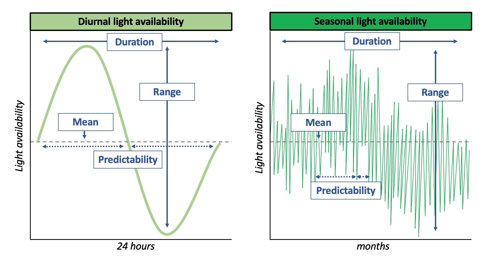
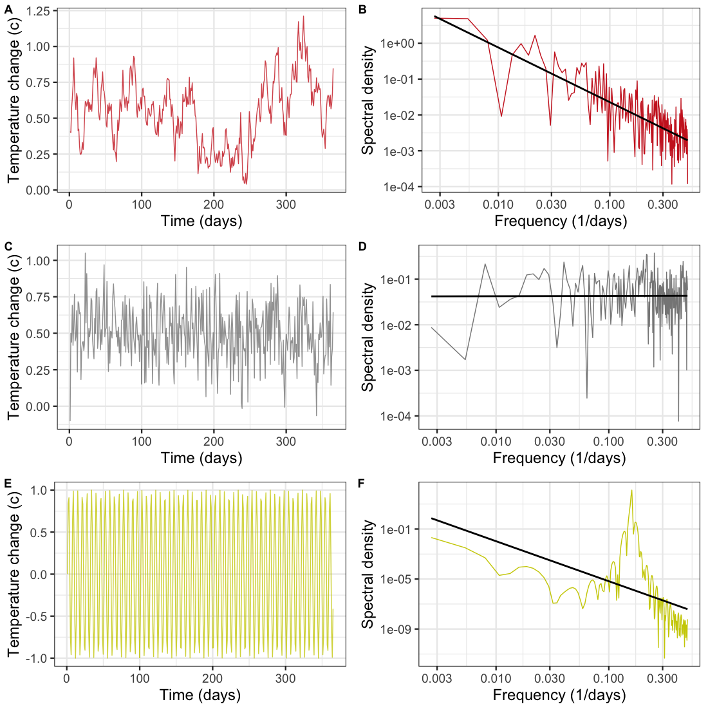

<!--
This is for including Chapter 1.  Notice that it's also good practice to name your chunk.  This will help you debug potential issues as you knit.  The chunk above is called intro and the one below is called chapter1.  Feel free to change the name of the Rmd file as you wish, but don't forget to change it here from 01-Background.Rmd.
-->

<!--
The {#rmd-basics} text after the chapter declaration will allow us to link throughout the document back to the beginning of Chapter 1.  These labels will automatically be generated (if not specified) by changing the spaces to hyphens and capital letters to lowercase.  Look for the reference to this label at the beginning of Chapter 2.
-->

# Background {}
## Environmental variability

```{r, echo=FALSE, fig.cap="An example of environmental variability using diurnal light availability to model how range, mean, predictability, and duration can be used to characterize different patterns of variability. Shown is a comparison of how duration of variability compares within the same environmental factor. Terms highlighted in each panel are described below in the main text.", out.width = '105%', fig.align="center", fig.scap="Metrics to describe and explain environmental variability."}

```

Environmental variability describes the dynamic characteristics of abiotic and biotic environmental conditions, in addition to how abiotic and biotic factors interact to drive organisms’ response to environmental conditions [@parepa_environmental_2013; @gudmundson_environmental_2015]. Though there are several characterized patterns of environmental variability (sinusoidal, stochastic, colored noise, reviewed below), patterns of variation can be further understood using the same core set of attributes: range, mean, duration, and predictability (Figure 1.1). 

### Mean
Aggregating values together, whether it be temperature, light availability, or precipitation, allows for a better understanding of trends and patterns as opposed to random events. The mean can be used as a zeroing point for any environmental condition that we can use to compare across patterns, studies, and time. It provides a departure point for what we expect the average value to be for all time. In certain cases, the mean is a useful metric for observing trends by minimizing the noise of environmental conditions, e.g. averaging population growth rates to understand if a disease is affecting organisms across geographic locations or just specific locations. However, in other cases, the mean is less useful compared to the variability. For instance, if there are key factors contributing to population growth rates from specific locations, comparing the amount of variability in additional variables across locations (individual respiration rates, temperature, etc.) is more fruitful for the task at this scale. At some point however, all data of interest are averages. The important distinction is the scale at which we average the data and the level of detail provided at each scale. Means are more useful in describing variation amongst normally distributed data, however, other statistical metrics like the median or mode may be more appropriate when the data is not normally distributed. 

### Amplitude/Range 
We can expand additional information adjacent to the mean (e.g. range, duration, predictability) for a finer scale picture of environmental conditions. Vasseur et al outlined that increases in temperature variation posed a greater risk to species than just simply considering increases in global temperature (2014). We can further quantify how variable an environment is by accounting for the range, or total span of conditions an organism may experience. This range can be short or long, for example, geographic location drastically influences the amount of sunlight an ecosystem receives. The Amazon Rainforest experiences less variation in light availability during the year than Denali National Park in Alaska, which experiences high variation in light availability between the summer and winter seasons. The range of environmental conditions an organism experiences can influence their ability to withstand changes in mean temperature [@amarasekare_framework_2012; @amarasekare_intrinsic_2013], as well as additional life history traits (size, speed, etc.). An organism’s ability to withstand changes in mean temperature has been attributed to the location of their optimal thermal temperature relative to the temperature at which survival is no longer possible and may be significantly impacted by increases in temperature range [@amarasekare_framework_2012]. If an organism has an optimal temperature close to their upper limit of survival, a larger range of variation may push the organism to spend more time beyond the optimal temperature. This would negatively impact their ability to adapt and withstand an upward thermal shift that occurs on a faster timescale than their adaptive evolution can manage. 

### Duration 
The amount of time an organism spends at different conditions is also important for how we understand and describe environmental variability. Variability can be examined on many different scales, from daily changes in light availability to seasonal changes in light availability (Figure 1.1). Short term fluctuations, such as Fluctuating Thermal Regimes (FTR), in which an organism only experiences a change in temperature for a short period of time (less than one generation), have differing effects on performance [@colinet_mechanisms_2018]. Performance is a set of whole organism traits (e.g. assimilation, development, metabolic rate) with the availability to perform dynamic actions and tasks pertinent to fitness or organismal success and is often used as a way to estimate the culmination of organismal processes that hinder or help an organisms’ persistence in the environment [@husak_how_2017; @amarasekare_framework_2012]. Studies that employ FTR are doing so in an explicitly ecologically irrelevant context, as organisms reared in a cold environment do not usually experience multiple warming exposures during a single day. However, there are instances in nature where organisms do experience short periods of extreme temperature changes (e.g. heat waves, cold fronts, etc.) in which the benefits of FTR in mitigating chill injuries may be helpful. Beyond the period of fluctuation organisms experience, it is important to also consider how the period of fluctuation aligns with individual, population, and community level processes. For instance, Temperature-dependent Sex Determination (TSD), in which ectotherms rely on the environment to incubate their larval offspring, is greatly affected by temperature changes during a specific window of development [@delmas_mechanistic_2007; @bowden_temperature_2018]. Further, at the population level, if organisms are closer or farther to carrying capacity, the impact of fluctuation may help or hinder population growth depending on the magnitude of variance [@lawson_environmental_2015]. When considering community dynamics, similar effects may appear depending on when a fluctuation occurs in time relative to predator/prey dynamics [@romanuk_environmental_2002; @dobramysl_environmental_2013; @bastille-rousseau_climate_2018].

### Predictability 

FTR can also describe the predictability of the fluctuation period. Variability may not have evenly spaced intervals (e.g. heat waves that occur at irregular intervals within a summer season), such that organisms can experience different amounts of variability for different amounts of time. Predictability can also attempt to describe stochastic vs. autocorrelated variation, however, that will be discussed in a different context below (Figure 1.3).  

### Link between temporal and spatial variability 

While not explicitly an area of study for this work, it is important to include how temporal and spatial variability can interact. Spatial variability describes how in three dimensional space, environments, organisms, and conditions can vary based on their location in space [@horne_spatial_1995; @farhang-sardroodi_environmental_2019]. Spatial variability can interact with temporal variability in cases where organisms mitigate temporally variable conditions by modifying their spatial location, e.g. Diel vertical migration (DVM). In DVM, organisms migrate to the surface and bottom of lakes and oceans based mainly on cues of light availability [@lampert_adaptive_1989; @brierley_diel_2014]. However, there are also instances in which the environment is not temporally variable, yet an organism utilizes spatial variability to regulate its behavior, e.g. an organism moving from sun to shade during the day to regulate body temperature and metabolic processes [@huey_behavioral_1974; @kearney_potential_2009]. 


Though environmental variability can include many different forms, from fluctuations in resource availability 
[@dempster_fluctuations_1981; @sommer_paradox_1984] to light [@ruel_jensens_1999; @morison_light_2020], one of the best studied and all-encompassing forms of fluctuations are thermal fluctuations [@huey_physiological_1990; @colinet_insects_2015]. 

## Temperature variability

### What is temperature variability?

Changes in temperature can be grouped into a couple different definitions, the first being the difference between the terms “fluctuating” and “variation” with respect to temperature. Though many studies have implicitly assumed the audience understands the distinction between the two terms, Colinet et al (2018) explicitly defined fluctuating temperature as “a generic term that refers to any discontinuous thermal regime that occurs on a short-term basis.” Most generally, temperature variability describes changes in environmental temperature through time [@holmes_robust_2016; @colinet_mechanisms_2018].  

### Why is temperature variability important to ecological processes?

Most organisms experience and rely on temperature to regulate metabolic processes or signal a behavior or response to ultimately persist in the environment [@huey_physiological_1990]. Brown et al (2004) highlighted the importance of both temperature and body size in the metabolic theory of  ecology (MTE). Though highly debated [@clarke_temperature_2006], MTE serves as an origin point for understanding how organisms respond to environmental conditions. MTE is described by the following equation:

$$
B = b_0M^{3/4}e^{-E/kT}
$$

Where $B$ is organismal metabolic rate, $b_0$ is a normalization constant unrelated to temperate or body size, $M$ is organismal mass, and $e^-E/kT$ is referred to as the “Boltzman factor”, where $E$ is activation energy, $k$ is the Boltzman constant and $T$ is temperature. Together, all of these values aim to describe the relationship between temperature and body size to determine metabolic rate. We assume that organismal level responses should scale across higher levels of organization, as MTE predicts that after correcting for body mass and temperature, metabolic rates for larger organisms should be higher and for smaller organisms should be lower. However, there are unexplained differences that the equation cannot fully explain, like heterogeneity in resting metabolic rate of teleost fish [@clarke_scaling_1999; @clarke_temperature_2006]. Others highlight that MTE makes valid assumptions and is more flexible than opponents argue, as it provides a foundational framework for general estimates of metabolic rate for larger, more generalizable taxonomic groups [@gillooly_response_2006]. Regardless of the debates about the details of MTE, at the very least, it provides a great foundation for thinking about temperature dependent processes. 

MTE relies upon temperature impacting metabolic rate, as chemical reactions proceed faster at higher temperatures, which can have downstream effects on fitness characteristics. This is typically described by a characteristic unimodal, left skewed response that organisms typically demonstrate called a thermal performance curve (TPC) (Figure 1.2).

```{r, echo=FALSE, fig.cap="Schematic of thermal performance curve and its important components for understanding thermal performance. CTmin denotes Critical Thermal Minimum, CTmax denotes Critical Thermal Maximum, and Topt denotes Thermal Optimum. Adapted from (Krenek et al 2012, Tuff et al 2016).", fig.align="center", out.width = '90%',fig.scap="Thermal performance curve components"}
knitr::include_graphics("figures/figure2.png")
```

The critical points that have been identified in thermal performance curves include: Thermal Optimum (Topt), Critical Thermal Minimum (CTmin), Critical Thermal Maximum (CTmax), Thermal tolerance breadth, and the Tolerance range. CTmin and CTmax describe the absolute limits of an organism's tolerance range, such that beyond these two thresholds, an organism cannot survive [@brown_toward_2004; @dowd_thermal_2015]. Topt is the temperature at which performance is highest, and is importantly situated just before the sharp decline in performance that converges on CTmax.

TPCs non-linear shape represents the relationship between temperature and performance, such that performance is an amalgamation of many life history characteristics and biological processes (e.g. metabolism) [@amarasekare_framework_2012]. If only temperature’s effect on metabolism were considered, the shape of the relationship may be an exponential one up to a certain point, after which it would no longer increase and the organism would fail to survive. However, there are several other constraining factors (e.g. energy acquisition, nutrient availability, etc.) that drive the characteristically nonlinear pattern of TPCs. TPCs represent the complexity of many interacting processes an organism experiences in the environment with respect to thermal dependence, cementing their place as an important metric to conceptualize and understand temperature dependence.  


### Jensen’s Inequality and its impacts on metabolic rate

TPCs have been crucial in predicting and understanding how organisms respond to their environment [@bernhardt_nonlinear_2018]. However, TPCs usually consist of measurements taken across an array of constant temperatures (e.g. 15-35°C in 5°C increments, with organisms reared at those temperatures constantly for the duration of an experiment to estimate thermal performance). These performance measurements are useful for a baseline understanding of thermal performance, however, they are not reflective of the variable conditions organisms experience in their natural environments. 

Given the characteristically nonlinear shape of TPCs, Jensen’s inequality is important in understanding the limits of thermal performance estimated under constant conditions versus variable conditions. Jensen’s inequality describes the phenomenon that environmental variation can predictably and significantly impact nonlinear biological processes such that the consequences cannot be aptly inferred from average environmental conditions [@ruel_jensens_1999]. For instance, Ruel and Ayres provide the development rate of ectotherms as an example to demonstrate Jensen’s inequality (1999). The development rate of ectotherms has a characteristically nonlinear shape, such that responses increase at lower temperatures, become linear at intermediate temperatures, and decrease at higher temperatures [@ruel_jensens_1999]. With Jensen’s inequality, we can predict that the effects of temperature variation will be positive at lower temperatures, neutral at intermediate temperatures, and negative at higher temperatures [@ruel_jensens_1999]. Given this, it is important to recognize that the constant temperatures used to generate TPCs are simply averages of environmental conditions during a moment in time. It is therefore reasonable to extrapolate that thermal performance under truly variable conditions may drastically differ and has been demonstrated by subsequent studies [@bernhardt_nonlinear_2018; @khelifa_usefulness_2019]. 

Beyond accurately predicting how variable environmental conditions affect thermal performance, the bounds and critical points of TPCs are important for understanding how changes in environmental conditions may differentially impact different groups of organisms. For instance, Amarasekare et al (2012) demonstrated the importance of where Topt is located relative to CTmax, such that ectotherms with a closer range between those two critical points at different geographic ranges may be negatively impacted by shifts in temperature and variability patterns [@amarasekare_framework_2012; @paaijmans_temperature_2013]. Ectotherms in warm regions with an already minimized distance between Topt and CTmax may risk rapid extinction because there is less of a buffer to withstand increases in environmental temperature [@amarasekare_framework_2012].

### Relevancy of thermal variability in the modern context 

Outside of the debate about the equations for determining metabolic rate, many of these equations rely on constant temperature conditions to predict metabolic rate. Variation in temperature is predicted to affect performance more significantly than increasing temperatures [@vasseur_increased_2014]; thus, if metabolic rates scale across species, communities, and ecosystems, how might non-constant temperature alter predictions regarding performance? Will increased variation have differing effects on different levels of biological organization? Khelifa et al (2019) demonstrated in five species from the same genus that when correcting for non-linearity, lab controlled experiments of diurnal variation in temperature and constant temperature did not differ significantly from one another in their thermal performance.  

However, beyond diurnal or sinusoidal variation, there are other variation patterns at different timescales that all levels of biological organization experience (Figure 1.3). Khelifa et al (2019) demonstrated that when organisms are exposed to ambient temperatures in the environment, their thermal performance becomes less predictable. Beyond diurnal fluctuations in temperature, organisms can experience seasonal fluctuations as well as annual fluctuations in temperature. Vasseur and Yodzis outline how the frequency (1/period) of environmental fluctuations describes the “color of environmental noise” [@vasseur_color_2004]. In colored noise, red noise describes lower frequencies and longer periods whereas white noise describes higher frequencies and shorter periods. Temperature is predicted to become more reddened or autocorrelated over time, meaning that temperatures will become more similar and predictable [@wigley_anthropogenic_1998-1; @tabari_shift_2012]. Understanding how organisms at all scales respond to these different patterns of variation in temperature is key for a more informed understanding of persistence.

```{r, echo=FALSE, fig.cap="Time series of daily changes in autocorrelated (A), stochastic (C), and diurnal (E) temperature variation over one year, accompanied by the respective spectral density plots for each pattern of variation (B,D,F). Adapted from and inspired by Massey et al 2020 and Kroeker et al 2020.", out.width = '90%', fig.align="center", fig.scap="Patterns of variability and spectral density plots"}

```

\clearpage

## Objectives, driving questions, hypotheses

Thermal fluctuations are expected to have an effect on performance across the individual, population, and community level:

 * At the individual level, this usually comes in the form of reduced fitness, increased development rates, and/or decreased physiological responses from reduced maximum temperatures, from flattening the thermal performance curve [@bartheld_thermal_2017-2] to changes in TSD ratios [@bowden_temperature_2018]
 
 * At the population level, this usually comes in the form of decreasing population densities [@anders_distribution-wide_2006]
 
 * At the community level, this usually comes in the form of promoting coexistence in the face of emigration [@descamps-julien_stable_2005], or population success via inflationary effects [@holt_impacts_2003]
 
It is, however, less understood how variation patterns influence these characteristic responses at each level of organization. Many individual level studies focus on responses to diurnal fluctuations in temperature, whereas studies at higher levels of biological organization have explored how colored noise elicits these characteristic responses [@petchey_environmental_2000].

There has yet to be a quantitative review of the effect of environmental variability across ecological scales, even though many studies have looked at the significance of variability on ecosystem dynamics [@kroeker_ecological_2020; @massey_measurement_2019]. To understand how environmental variability affects organisms, populations, and communities, we conducted a meta-analysis on the effects of thermal variability on responses across different levels of biological organization to answer the following questions: 1) Does variability pattern drive differences in response magnitude? (i.e. does autocorrelated variation have a larger impact on response than stochastic or diurnal variation?), 2) Does temperature variability drive differential response levels at different levels of biological organization?, 3) How can the magnitude of response be influenced by additional factors (e.g. periodicity, age, size, thermal history, etc.)? We aim to answer these questions by collecting data from the literature at different levels of biological organization to systematically analyze responses across levels of organization. 


We hypothesize that: 1) The larger the range of temperatures an organism will experience relative to their thermal performance curve will negatively impact the magnitude of response, 2) Additional covariates related to biological fitness and success, experimental age and organism size will be correlated with negative responses, such that older organisms will exhibit increased performance and smaller organisms will exhibit decreased performance with increased thermal variability, 3) Across organization levels, individual level studies will experience decreased performance compared to population level studies and higher levels of organization due to their ability to mitigate and rescue performance with population dynamics, 4) If organisms experience temperatures that exceed their Topt, their responses will be negatively impacted.
