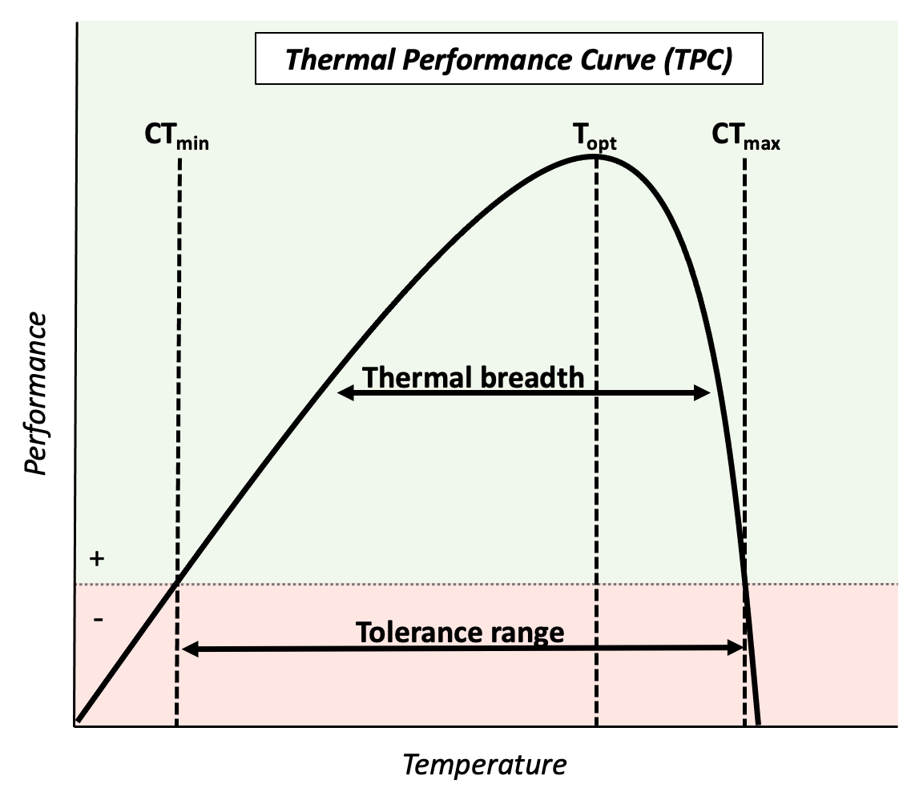

<!--
This is for including Chapter 1.  Notice that it's also good practice to name your chunk.  This will help you debug potential issues as you knit.  The chunk above is called intro and the one below is called chapter1.  Feel free to change the name of the Rmd file as you wish, but don't forget to change it here from chap1.Rmd.
-->

<!--
The {#rmd-basics} text after the chapter declaration will allow us to link throughout the document back to the beginning of Chapter 1.  These labels will automatically be generated (if not specified) by changing the spaces to hyphens and capital letters to lowercase.  Look for the reference to this label at the beginning of Chapter 2.
-->

# Background 
## Environmental variability
Environmental variability describes the dynamic nature of environmental conditions in the natural world and how organisms respond (cite). Though there are several characterized patterns of environmental variability (sinusoidal, stochastic, colored noise, reviewed below), patterns of variation can be further understood using the same core set of attributes: range, mean, duration, and predictability (Figure X). 

```{r, echo=FALSE, fig.cap="Figure 1. An example of environmental variability using diurnal light availability to model how range, mean, predictability, and duration can be used to characterize different patterns of variability. Shown is a comparison of how duration of variability compares across the same environmental factor", out.width = '90%'}
knitr::include_graphics("figures/figure1.png")
```

### Mean
Aggregating values together, whether it be temperature, light availability, precipitation, allows for a better understanding of trends and patterns as opposed to random events. The mean can be used as a zeroing point for any environmental condition that we can use to compare across patterns, studies, and time. It provides a departure point for what we expect the average value to be for all time. We can then expand additional information adjacent to the mean (i.e. range, duration, predictability) for a finer scale picture of environmental conditions, as Vasseur et al outlined that increases in temperature variation posed a greater risk than just simply considering increases in global temperature (2014). 

### Amplitude/Range 
We can further quantify how variable an environment is by accounting for the range, or total span of conditions an organism may experience. This range can be short or long, for example, geographic location drastically influences the amount of sunlight an ecosystem receives. The Amazon Rainforest experiences less variation in light availability during the year than Denali National Park in Alaska, which experiences high variation in light availability between the summer and winter seasons. The range of environmental conditions an organism experiences can influence their ability to withstand changes in mean temperature (Amarasekare et al 2013, 2012), as well as additional life history traits (size, speed, etc.). 

### Duration 
The amount of time an organism spends at different conditions is also important for how we understand and describe environmental variability. Variability can be examined on many different scales, from daily changes in light availability to seasonal changes in light availability (Figure X). Short term fluctuations, like Fluctuating Thermal Regimes (FTR), in which an organism only experiences a change in temperature for a short period of time, have differing effects on performance (Colinet et al 2018). While studies that employ FTR are doing so in an explicitly ecologically irrelevant context, there are instances in nature where organisms do experience short periods of extreme temperature changes (i.e. heat waves, cold fronts etc.). 

Beyond the period of fluctuation organisms experience, it is important to also consider how the period of fluctuation aligns with organism, population, and community level processes. For instance, Temperature-dependent Sex Determination (TSD), in which ectotherms rely on the environment to incubate their larval offspring, is greatly affected by temperature changes during that specific window of development (cite). Further, at the population level, if organisms are closer or farther to carrying capacity, the impact of fluctuation may help or hinder population growth (cite). When considering community dynamics, similar effects may appear depending on when a fluctuation occurs in time relative to predator/prey dynamics (cite).

### Predictability 
FTR can also describe the predictability of the fluctuation period. Variability may not have evenly spaced intervals (i.e. heatwaves that occur at irregular intervals within a summer season), such that organisms can experience different amounts of variability for different amounts of time. Predictability can also attempt to describe stochastic vs. autocorrelated variation, however, that will be discussed in a different context below (Figure 4).  

Link between temporal and spatial variability 
While not explicitly an area of study for this work, it is important to include how temporal and spatial variability can interact. Spatial variability describes how in three dimensional space, environments, organisms, and conditions can vary based on their location in space (cite). Spatial variability can interact with temporal variability in cases where organisms mitigate temporally variable conditions by modifying their spatial location, i.e. Diel vertical migration (DVM). In DVM, organisms migrate to the surface and bottom of lakes based mainly on cues of light availability (cite). However, there are also instances in which the environment is not temporally variable yet an organism utilizes spatial variability to regulate its behavior, i.e. an organism moving from sun to shade during the day to regulate body temperature and metabolic processes (cite). 

Though environmental variability can include many different forms, from fluctuations in resource availability (cite) to light (cite), one of the best studied and all-encompassing forms of fluctuations are thermal fluctuations (cite). 

## Thermal variability

### What is temperature variability?
Changes in temperature can be grouped into a couple different orientations, the first being the difference between the terms “fluctuating” and “variation” with respect to temperature. Though many studies have implicitly assumed the audience understands the distinction between the two terms, Colinet et al explicitly defined fluctuating temperature as “a generic term that refers to any discontinuous thermal regime that occurs on a short-term basis” (2018). In any case, temperature variability describes changes in environmental temperature through time (cite). 


### Why is it important to ecological processes?
Most organisms experience and rely on temperature to regulate metabolic processes or signal a behavior or response to ultimately persist in the environment (cite). Brown et al (2004) highlighted the importance of both temperature and body size in the metabolic theory of  ecology (MTE), though highly debated (Clarke et al 2006), which serves as an origin point for understanding how organisms respond to environmental conditions. MTE is described by the following equation:

$$
B = b_0M^{3/4}e^{-E/kT}
$$
Where $B$ is organismal metabolic rate, $b_0$ is a normalization constant unrelated to temperate or body size, $M$ is organismal mass, and $e^-E/kT$ is referred to as the “Boltzman factor”, where $E$ is activation energy, $k$ is the Boltzman constant and $T$ is temperature. Together, all of these values aim to describe the relationship between temperature and body size to determine metabolic rate. We assume that organismal level responses should scale across higher levels of organization, as MTE predicts that after correcting for body mass and temperature, metabolic rates should be the same. However, there are unexplained differences that the equation cannot fully explain, like heterogeneity in resting metabolic rate of teleost fish (Clark and Johnston 1999, Clarke et al 2006). Others believe that MTE makes valid assumptions and is more flexible than opponents argue (Gillooly et al 2006). 

MTE supports temperature impacting metabolic rate, which can have downstream effects on fitness characteristics. This is typically described by a characteristic unimodal, right skewed response that organisms typically demonstrate called a thermal performance curve (TPC) (Figure 2). 

```{r, echo=FALSE, fig.cap="Figure 2. Schematic of thermal performance curve and it’s important components for understanding thermal performance. Adapted from (cite, cite)", out.width = '90%'}

```


The critical points that have been identified in thermal performance curves include: Thermal Optimum (Topt), Critical Thermal Minimum (CTmin), Critical Thermal Maximum (CTmax), Thermal tolerance breadth, and the Tolerance range. CTmin and CTmax describe the absolute limits of an organism's tolerance range, such that beyond these two thresholds, organisms’ performance is negatively impacted (cite). Topt is the temperature at which performance is highest, and is importantly situated just before the sharp decline in performance that converges on CTmax.

### Jensen’s Inequality and its impacts on metabolic rate
TPCs have been crucial in predicting, understanding, and capitulating how organisms respond to their environment (cite, Bernhardt et al 2018). However, TPCs usually consist of measurements taken across an array of constant temperatures (i.e. 15-35 C in 5 C increments, with organisms reared at those temperatures constantly for the duration of an experiment to estimate thermal performance). These performance measurements are useful for a baseline understanding of thermal performance, however, they are not reflective of the variable conditions organisms experience in their environments. 

Given the characteristically non-linear shape of TPCs, Jensen’s inequality is important in understanding the limits of thermal performance estimated under constant conditions versus variable conditions. Jensen’s inequality describes the phenomenon that environmental variance can predictably and significantly impact nonlinear biological processes such that the consequences cannot be aptly inferred from average environmental conditions (Ruel and Ayres, 1999). Given this, it is important to recognize that the constant temperatures used to generate TPCs are simply averages of environmental conditions during a moment in time. It is therefore reasonable to extrapolate that thermal performance under truly variable conditions may drastically differ and has been demonstrated by subsequent studies (Bernhardt et al 2018, Khelifa et al 2019. 

Beyond accurately predicting how variable environmental conditions affect thermal performance, the bounds and critical points of TPCs are important for understanding how changes in environmental conditions may differentially impact different groups of organisms. For instance, Amarasekare et al (year) demonstrated the importance where Topt is located relative to CTmax, such that ectotherms with a closer range between those two critical points at different geographic ranges may be negatively impacted by shifts in temperature and variability patterns (cite 2012). Ectotherms in warm regions with an already minimized distance between Topt and CTmax may risk rapid extinction because there is less of a buffer to withstand increases in environmental temperature (cite 2012).

### The relevancy of temperature variability in the modern context 

```{r, echo=FALSE, fig.cap="Figure 3. DON’T FORGET THIS IS LOG SCALED!! Plot of generation time in days against fluctuation period in days, with yellow, red, and grey horizontal panels representing diurnal, autocorrelated, and stochastic fluctuation patterns. The blue, green, purple, and pink horizontal lines represent different examples of variety in organismal generation time. *Figure out how to overlap pngs of plankton for 1, drosophila for 10, beetle for 100, and fish for 4000*", out.width = '90%'}

```

Outside of the debate about the equations for determining metabolic rate, many of these equations rely on constant temperature conditions to predict metabolic rate. Variation in temperature is predicted to affect performance more significantly than increasing temperatures (Vasseur et al 2014); thus, if there is disagreement about how metabolic rates scale across species, communities, and ecosystems, how might non-constant temperature alter predictions regarding performance. Khelifa et al (2019) demonstrated that when correcting for non-linearity, lab controlled experiments of diurnal variation in temperature and constant temperature did not differ significantly from one another in their thermal performance. 

```{r, echo=FALSE, fig.cap="Figure 4. Time series of daily changes in autocorrelated (A), stochastic (C), and diurnal (E) temperature variation over one year, accompanied by the respective spectral density plots for each pattern of variation (B,D,F). Adapted from and inspired by Massey et al 2020 and Kroeker et al 2020.", out.width = '90%'}
knitr::include_graphics("figures/figure4.png")
```

However, beyond diurnal or sinusoidal variation, there are other variation patterns at different timescales that all levels of biological organization experience (Figure 4). Khelifa et al demonstrated that when organisms are exposed to ambient temperatures in the environment, their thermal performance becomes less predictable (2019). Beyond diurnal fluctuations in temperature, organisms can experience seasonal fluctuations as well as annual fluctuations in temperature. Vasseur and Yodzis (2004) outline how the frequency (1/period) of environmental fluctuations describes the “color of environmental noise.” In colored noise, red noise describes lower frequencies and longer periods whereas white noise describes higher frequencies and shorter periods. Temperature is predicted to become more reddened or autocorrelated over time, meaning that temperatures will become more similar and predictable (cite). Understanding how organisms at all scales respond to these different patterns of variation in temperature is key for a more informed understanding of persistence. 

Thermal fluctuations are expected to have an effect on performance across the individual, population, and community level (cite):

* At the individual level, this usually comes in the form of reduced fitness or increased development rates (cite)
* At the population level, this usually comes in the form of increases to population saturation
* At the community level, this usually comes in the form of promoting coexistence or population success in the face of emigration

It however, less understood, is how variation patterns influence these characteristic responses at each level of organization. Many individual level studies focus on responses to diurnal fluctuations in temperature, whereas higher levels of organization have explored how colored noise elicits these characteristic responses (cite).

## Objectives, driving questions, hypotheses

There has yet to be a quantitative review of the effect of environmental variability across ecological scales, even though many studies have looked at variability (cite). To understand how environmental variability affects organisms, populations, and communities, we conducted a meta analysis on the effects of thermal variability on responses across different levels of biological organization to answer the following questions: 

1. Does variability pattern drive differences in response magnitude? (i.e. does autocorrelated variation have a larger impact on response than stochastic or diurnal?)
2. Does temperature variability drive differential response levels at different levels of biological organization?
3. How can the magnitude of response be influenced by additional factors (i.e. periodicity, age, size, thermal history, etc)? 

We aim to answer these questions by collecting data from the literature at different levels of biological organization to systematically analyze responses across levels of organization. 


## Lists

It's easy to create a list.  It can be unordered like

* Item 1
* Item 2

or it can be ordered like

1. Item 1
4. Item 2

Notice that I intentionally mislabeled Item 2 as number 4.  _Markdown_ automatically figures this out!  You can put any numbers in the list and it will create the list.  Check it out below.

To create a sublist, just indent the values a bit (at least four spaces or a tab).  (Here's one case where indentation is key!)

1. Item 1
1. Item 2
1. Item 3
    - Item 3a
    - Item 3b

## Line breaks

Make sure to add white space between lines if you'd like to start a new paragraph.  Look at what happens below in the outputted document if you don't:

Here is the first sentence.  Here is another sentence.  Here is the last sentence to end the paragraph.
This should be a new paragraph.

*Now for the correct way:* 

Here is the first sentence.  Here is another sentence.  Here is the last sentence to end the paragraph.

This should be a new paragraph.

## R chunks

When you click the **Knit** button above a document will be generated that includes both content as well as the output of any embedded **R** code chunks within the document. You can embed an **R** code chunk like this (`cars` is a built-in **R** dataset):

```{r cars}
summary(cars)
```

## Inline code

If you'd like to put the results of your analysis directly into your discussion, add inline code like this:

> The `cos` of $2 \pi$ is `r cos(2*pi)`. 

Another example would be the direct calculation of the standard deviation:

> The standard deviation of `speed` in `cars` is `r sd(cars$speed)`.

One last neat feature is the use of the `ifelse` conditional statement which can be used to output text depending on the result of an **R** calculation:

> `r ifelse(sd(cars$speed) < 6, "The standard deviation is less than 6.", "The standard deviation is equal to or greater than 6.")`

Note the use of `>` here, which signifies a quotation environment that will be indented.

As you see with `$2 \pi$` above, mathematics can be added by surrounding the mathematical text with dollar signs.  More examples of this are in [Mathematics and Science] if you uncomment the code in [Math].  

## Including plots

You can also embed plots. For example, here is a way to use the base **R** graphics package to produce a plot using the built-in `pressure` dataset:

```{r pressure, echo=FALSE, cache=TRUE, fig.height=3, fig.width=5}
plot(pressure)
```

Note that the `echo=FALSE` parameter was added to the code chunk to prevent printing of the **R** code that generated the plot. There are plenty of other ways to add chunk options (like `fig.height` and `fig.width` in the chunk above).  More information is available at <https://yihui.org/knitr/options/>.  

Another useful chunk option is the setting of `cache=TRUE` as you see here.  If document rendering becomes time consuming due to long computations or plots that are expensive to generate you can use knitr caching to improve performance.  Later in this file, you'll see a way to reference plots created in **R** or external figures.

## Loading and exploring data

Included in this template is a file called `flights.csv`.  This file includes a subset of the larger dataset of information about all flights that departed from Seattle and Portland in 2014. More information about this dataset and its **R** package is available at <https://github.com/ismayc/pnwflights14>. This subset includes only Portland flights and only rows that were complete with no missing values. Merges were also done with the `airports` and `airlines` data sets in the `pnwflights14` package to get more descriptive airport and airline names.

We can load in this data set using the following commands:

```{r load_data}
# flights.csv is in the data directory
flights_path <- here::here("data", "flights.csv")
# string columns will be read in as strings and not factors now
flights <- read.csv(flights_path, stringsAsFactors = FALSE)
```

The data is now stored in the data frame called `flights` in **R**.  To get a better feel for the variables included in this dataset we can use a variety of functions. Here we can see the dimensions (rows by columns) and also the names of the columns.

```{r str}
dim(flights)
names(flights)
```

Another good idea is to take a look at the dataset in table form.  With this dataset having more than 20,000 rows, we won't explicitly show the results of the command here. I recommend you enter the command into the Console **_after_** you have run the **R** chunks above to load the data into **R**.

```{r view_flights, eval=FALSE}
View(flights)
```

While not required, it is highly recommended you use the `dplyr` package to manipulate and summarize your data set as needed.  It uses a syntax that is easy to understand using chaining operations.  Below I've created a few examples of using `dplyr` to get information about the Portland flights in 2014.  You will also see the use of the `ggplot2` package, which produces beautiful, high-quality academic visuals.

We begin by checking to ensure that needed packages are installed and then we load them into our current working environment:

```{r load_pkgs, message=FALSE}
# List of packages required for this analysis
pkg <- c("dplyr", "ggplot2", "knitr", "bookdown")
# Check if packages are not installed and assign the
# names of the packages not installed to the variable new.pkg
new.pkg <- pkg[!(pkg %in% installed.packages())]
# If there are any packages in the list that aren't installed,
# install them
if (length(new.pkg)) {
  install.packages(new.pkg, repos = "https://cran.rstudio.com")
}
# Load packages
library(thesisdown)
library(dplyr)
library(ggplot2)
library(knitr)
```

\clearpage

The example we show here does the following:

- Selects only the `carrier_name` and `arr_delay` from the `flights` dataset and then assigns this subset to a new variable called `flights2`. 

- Using `flights2`, we determine the largest arrival delay for each of the carriers.

```{r max_delays}
flights2 <- flights %>%
  select(carrier_name, arr_delay)
max_delays <- flights2 %>%
  group_by(carrier_name) %>%
  summarize(max_arr_delay = max(arr_delay, na.rm = TRUE))
```

A useful function in the `knitr` package for making nice tables in _R Markdown_ is called `kable`.  It is much easier to use than manually entering values into a table by copying and pasting values into Excel or LaTeX.  This again goes to show how nice reproducible documents can be! (Note the use of `results="asis"`, which will produce the table instead of the code to create the table.)  The `caption.short` argument is used to include a shorter title to appear in the List of Tables.

```{r maxdelays, results="asis"}
kable(max_delays,
  col.names = c("Airline", "Max Arrival Delay"),
  caption = "Maximum Delays by Airline",
  caption.short = "Max Delays by Airline",
  longtable = TRUE,
  booktabs = TRUE
)
```

The last two options make the table a little easier-to-read.

We can further look into the properties of the largest value here for American Airlines Inc.  To do so, we can isolate the row corresponding to the arrival delay of 1539 minutes for American in our original `flights` dataset.


```{r max_props}
flights %>%
  filter(
    arr_delay == 1539,
    carrier_name == "American Airlines Inc."
  ) %>%
  select(-c(
    month, day, carrier, dest_name, hour,
    minute, carrier_name, arr_delay
  ))
```

We see that the flight occurred on March 3rd and departed a little after 2 PM on its way to Dallas/Fort Worth.  Lastly, we show how we can visualize the arrival delay of all departing flights from Portland on March 3rd against time of departure.

```{r march3plot, fig.height=3, fig.width=6}
flights %>%
  filter(month == 3, day == 3) %>%
  ggplot(aes(x = dep_time, y = arr_delay)) +
  geom_point()
```

## Additional resources

- _Markdown_ Cheatsheet - <https://github.com/adam-p/markdown-here/wiki/Markdown-Cheatsheet>

- _R Markdown_
    - Reference Guide - <https://www.rstudio.com/wp-content/uploads/2015/03/rmarkdown-reference.pdf>
    - Cheatsheet - <https://github.com/rstudio/cheatsheets/raw/master/rmarkdown-2.0.pdf>

- _RStudio IDE_
    - Cheatsheet - <https://github.com/rstudio/cheatsheets/raw/master/rstudio-ide.pdf>
    - Official website - <https://rstudio.com/products/rstudio/>

- Introduction to `dplyr` - <https://cran.rstudio.com/web/packages/dplyr/vignettes/dplyr.html>

- `ggplot2`
    - Documentation - <https://ggplot2.tidyverse.org/>
    - Cheatsheet - <https://github.com/rstudio/cheatsheets/raw/master/data-visualization-2.1.pdf>

