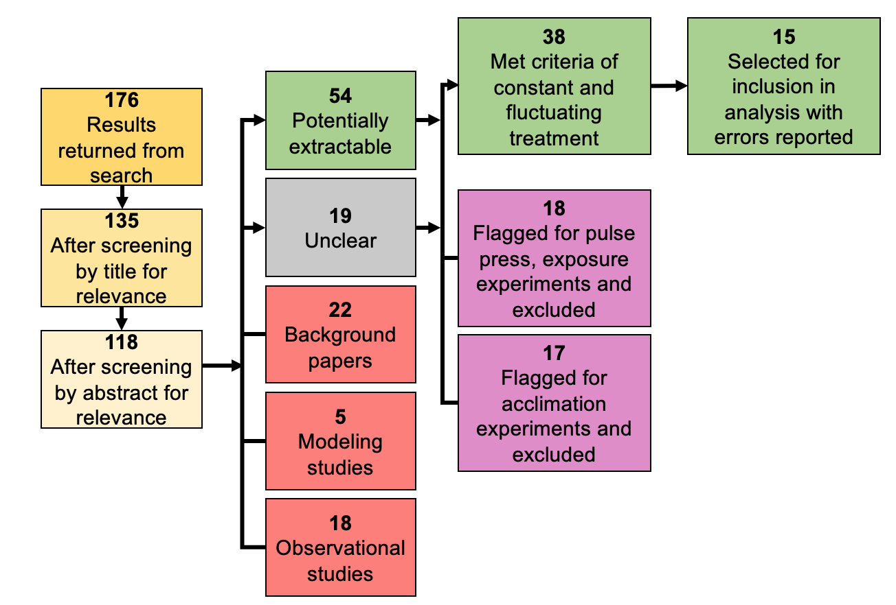

# Methods {}
```{r, include=FALSE}
pacman::p_load(knitr, kableExtra, tidyverse)
```

```{r, echo=FALSE, fig.cap="Diagram of the paper selection process from the original 176 papers returned from the Web of Science search to the 19 studies included in the analysis. Red indicates no usable data, purple indicates some usable data but not for our study questions, and green indicates usable data flow for inclusion in analysis.", out.width = '90%', fig.align="center", fig.scap="Meta-analysis paper selection process"}

```

We conducted a systematic literature search using the ISI Web of Science database to collect studies that investigated the effects of temperature variability (Figure 2.1). After trying several different combinations of search terms to capture research on temperature variability, our final search utilized these search terms in an advanced search: AK=((temperature OR thermal) NEAR (vari* OR fluc*)) AND SU=(Life Sciences & Biomedicine). This search returned a total of 176 results. We downloaded the .bib file of this search and imported this file into the revtools R package (version 0.4.1). Using the revtools package we then screened studies by title, then by abstract, for inclusion in analysis (Figure 2.1). Once we screened studies for relevance to the field of biology and environmental variation, we began excluding studies using the following strict criteria: 

* We excluded studies that did not feature both a constant and fluctuating treatment (i.e. studies with several fluctuating treatments but no constant comparison or studies with a gradient of constant treatment temperatures but no periodic fluctuating treatment)
* We excluded studies that were not completed in a laboratory (i.e. modeling predictions or results from models, mesocosm experiments, in situ experiments)
* We excluded studies in which the responses were measured in different thermal conditions than the incubation or rearing thermal conditions (i.e. organisms reared in fluctuating temperatures, but measured responses at different constant temperatures to yield a thermal performance curve (TPC))
* We excluded any articles not written in English 
* We excluded studies that did not report measurements of error
* We excluded studies in which the response variables are comparable or extractable (i.e. one study performed Principal component analysis for their responses)

We excluded studies that did not have the same mean for constant and fluctuating treatments (i.e. treatments at the minimum and maximum with a fluctuation treatment across the range) or a mean within 1°C of the two treatments. We chose to exclude studies that did not match this criteria as there would not have been a baseline comparison to attribute changes in response magnitude to most simply variation, as changes in mean temperature significantly influence the magnitude of response [@brown_toward_2004].  The final number of data points included in the analysis is broken down by study (Table 2.1). 

\clearpage

```{r, echo = FALSE}
table1 <- data.frame(Cat = c("Delava et al", "Du et al", 
                         "Garcia-Ruiz et al", "Glass et al", 
                         "Kern et al", "Kern et al", 
                         "Lowenborg et al", "Maneti et al", 
                         "Pendlebury et al", "Qu et al", 
                         "Rolandi et al", "Saxon et al", 
                         "Semenov et al", "Simoncini et al", 
                         "Treidel et al"), 
                 Year = c("2016", "2009", "2011", "2009", "2015", "2014",
                          "2012", "2014", "2004", "2014", "2018", "2017",
                          "2007", "2019", "2015"), 
                 `Extracted data points (n)` = c("16", "32", "16", "16", "24",
                                                 "4", "10", "24", "16", "40", "4", 
                                                 "12", "32", "30", "4"))
kable(table1, "latex", booktabs = T, col.names = c("Study", "Year", "Extracted data points (n)"), escape = F, caption = "Studies included in analysis of thermal variability (n=15)", 
      caption.short ="Studies included in analysis of thermal variability") %>%
   row_spec(0,bold=TRUE)%>%
   kable_styling(latex_options = c("striped", "hold_position"))
```


## Data extraction and analysis 

From the studies that met our inclusion criteria, we extracted data from tables and figures. Figures were extracted via .png files imported into WebPlotDigitizer to obtain the raw data. The extracted data was then imported into a master spreadsheet of data from all studies for analysis. We extracted mean values for response variables, any measure of variance (Standard Deviation (SD) or Standard Error of the Mean (SEM)), and sample size. For studies that reported error as SEM, we converted SEM to SD by multiplying the SEM by the square root of the same SEM. We also collected information on mean temperature, fluctuation range, organization level, body size, life stage, response type, thermal stress, and aggregated these values (Table 2.2).

If studies reported findings using medians and the Interquartile Range (IQR) via boxplots, a normal distribution of the data was assumed and a subsequent calculation was performed, such that the median is the mean and the IQR is the SD with a conversion calculation [@higgins_cochrane_2011]. Lastly, if extracted values were missing variance or sample size estimates, the points were automatically excluded via the data analysis software, metafor. 

\clearpage

```{r, echo = FALSE, include = TRUE}
table2 <- data.frame(Variable = c("mean_temp_constant", "flux_range", 
                         "org_level", "size", 
                         "exp_age", "resp_type", 
                         "stressful"),
                     Description = c("Reported mean temperature (°C) in study",
                                     "Reported range (difference between minimum 
                                     and maximum) of temperature fluctuation (°C) experienced", 
                                     "Level of biological organization, categorized
                                     as either 0 for individual or 1 for population level
                                     responses", 
                                     "Size estimate of study organism, 0 for extra-small (less than 1mm),
                                     1 for small (less than 5 cm), 2 for medium (less than 0.3 m), and 3
                                     for large (greater than 0.3 m)", 
                                     "Life stage at which experiment was conducted, 
                                     categorized as 0 for larval, 1 for juvenile (not sexually mature),
                                     and 2 for adult",
                                     "Response variable units classified as rates or traits, 
                                     such that rates included any response variable units with a
                                     “per day” clarifier, all else as traits",
                                     "Whether or not the organisms experienced thermally stressful 
                                     temperatures throughout study duration, if temperature range 
                                     exceeded Topt, classified as thermally stressful, else not
                                     thermally stressful. See Appendix Table 1 for references in which
                                     organisms’ thermal stress metrics were included"))

kable(table2, caption = "Covariates included in models", "latex", booktabs = T) %>%
  column_spec(2, width = "8cm") %>%
   row_spec(0,bold=TRUE)%>%
   kable_styling(latex_options = c("striped", "hold_position"))
```


\clearpage

## Metafor 

We utilized metafor (version 2.4.0) in R to analyze the extracted, aggregated data. Metafor builds on the functionality of older meta-analysis packages (meta, etc.) by allowing for greater flexibility in model types (mixed and random effects models) [@viechtbauer_conducting_2010]. In order to use metafor, the package requires the data to be in a wider format, in which data are input into the following columns:     

```{r, echo = FALSE}
table3 <- data.frame(Cat = c("Mf", "SDf", 
                         "Mc", "SDc", 
                         "Nf", "Nc"), 
                 Purpose = c("Mean of experimental group ", 
                             "Standard deviation of the experimental group",
                             "Mean of the control group",
                             "Standard deviation of the control group",
                             "Sample size (n) of the experimental group",
                             "Sample size (n) of the control group"))
kable(table3, "latex", booktabs = T, col.names = c("Column name", "Purpose"), escape = F, caption = "Column names expanded to wider format for data analysis in metafor") %>%
   row_spec(0,bold=TRUE) %>%
   kable_styling(latex_options = c("striped", "hold_position"))
```

\linebreak

Formatting the data in this way allows for metafor to calculate an effect size and sampling variance for each row in the dataset, such that a constant treatment and corresponding fluctuating treatment will be paired together using the `escalc` function in metafor to calculate effect size and sampling variance:
```{r, eval= FALSE}
escalc(measure="SMD", m1i=`constant_resp`, m2i=flux_resp, 
            sd1i=`SD_constant`, sd2i= `SD_variable`, n1i=constant_samp, 
       n2i=flux_samp, data=dat_MA, slab=paste(study_id, experiment_id, 
                                              response_id, sep=", "))
```
We specified the effect size metric of interest to be the standardized mean difference (SMD), as this is a common calculation used to compare two groups head to head [@viechtbauer_conducting_2010]. It is also a powerful metric to use in a meta-analysis because it standardizes the responses across studies to reduce heterogeneity and bias [@viechtbauer_conducting_2010]. Each of the subsequent arguments of the `escalc` function specify the mean, standard deviation, and sample size for each paired constant and fluctuating treatment. The `escalc` function is using multiple equations to ultimately output the SMD and sampling variance, all of which are below (Figure 2.2). 

```{r, echo= FALSE, fig.cap= "Workflow diagram of how data were extracted, analyzed, and processed for downstream analysis in metafor.", out.width="100%", fig.scap="Workflow of analysis in metafor"}

```

First, it calculates the pooled standard deviation (Pooled SD) from the sample sizes of both studies. Our data had studies with a wide range of sample sizes, so we wanted to include separate sample sizes between the constant and fluctuating treatments. The Pooled SD, Cohen’s d, which is one of the most common ways to measure effect size, is used to normalize the mean differences between constant and fluctuating treatments. Then, using a correction factor J, which again normalizes the data further, we obtain the final SMD. The SMD is then ultimately used to calculate the sampling variance, which creates a unitless metric for variance. 

Both the SMD and sampling variance are then input into the `rma.mv` function in metafor to generate a multivariate random effects model to understand how variability compares across studies and what factors may influence the magnitude of response. We first ran a multivariate random effects model without modifiers (simple model) to establish baseline heterogeneity between studies to then examine modifiers that could better explain the heterogeneity in effect sizes across studies:

```{r, eval = FALSE}
rma.mv(yi, vi, 
       data=dat_MA_ES, 
       random = ~1 | study_id / experiment_id/ response_id, 
       method="REML") 
```
               
The arguments of the `rma.mv` function include SMD (yi), sampling variance (vi), the datafile, as well the random argument to specify the structure of the model. We specified a nested structure to account for the colinearity of data points from within the same study, experiment, and response metric. We used Restricted Maximum-Likelihood (REML) to specify the fit of the model, as REML is best at handling small samples sizes compared to Maximum Likelihood (ML) [@viechtbauer_conducting_2010]. We chose a random effects model as opposed to a fixed effects model because we were interested in better understanding the patterns of the larger population of environmental variability literature, as we assumed the studies that were included in this analysis to be a random selection from the true population [@viechtbauer_conducting_2010]. The random effects model structure also allowed us to account for the nested structure of responses, experiment, and study to address the dependence of observations from within each study. The multivariate random effects model with all modifiers (full model) we ran included:
 

```{r, eval = FALSE}
rma.mv(yi, vi, data=dat_MA_ES, mods = ~flux_range * mean_temp_constant 
       + exp_age + size + org_level + resp_type, 
               random = ~1 |  study_id/ experiment_id/ response_id,
                 method="REML") 
```


The full model also included an interaction term between mean temperature and fluctuation range to understand if mean temperature coupled with fluctuation range was an important component in explaining patterns of variation. If an organism experiences large fluctuations in temperature range at a high mean temperature, it is more likely to exceed an organisms’ Topt and become thermally stressful. 

We decided to exclude the thermally stressful covariate as an argument in the full model because we lacked thermal stress data for one study. That particular study happened to be very influential in our model but the data was not misrepresented, as the data was extracted from a table (Garcia-Ruiz et al 2011, Table 1). The  multivariate random effects model with all the covariates in the full model as well as thermal stress (exclusion model), which excluded Garcia-Ruiz et al 2011 entirely, included:

```{r, eval = FALSE}
rma.mv(yi, vi, data=dat_MA_ES, mods = ~flux_range * mean_temp_constant 
       + exp_age + size + org_level + resp_type + stressful, 
               random = ~1 |  study_id/ experiment_id/ response_id,
                 method="REML") 
```

We also ran a separate model without this study and included the thermal stress covariate separately from all the other modifiers (thermal stress model) to see if thermal stress was truly an important factor or if it was simply excluding those influential data points:

```{r, eval =FALSE}
rma.mv(yi, vi, data=dat_MA_ES, mods =  ~ stressful, 
               random = ~1 | experiment_id/ study_id/ response_id,
                 method="REML") 
```

